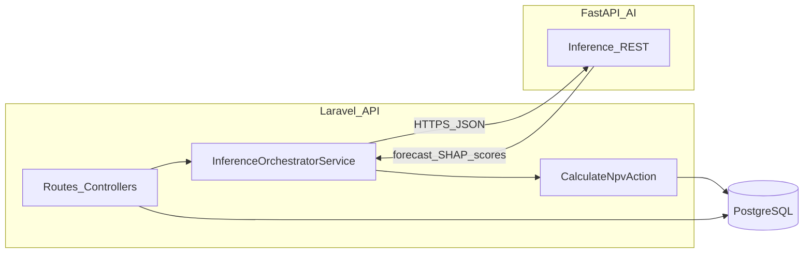

# Product Requirements Document (PRD) — Backend Only

## Ethio-SME Valuation System — Laravel API Gateway & Orchestrator

### Version 1.0 | May 2026

**Scope:** This document specifies **only** the Laravel (PHP) backend: authentication, persistence, regulatory compliance, mock payment ingestion, time-series aggregation, orchestration of the external AI inference service, NPV-based credit limit derivation, loan decisioning, adverse-action records, drift/fairness surfacing, and audit APIs.

**Out of scope for this PRD:** Vue/React frontends, JWT routing guards in SPA, ECharts/Plotly/SHAP visual rendering, Python model training/inference internals (DeepAR/LSTM/XGBoost training, `.pkl`/`.h5` loading), live Chapa/Telebirr APIs, Fayda biometric KYC, and core-banking (e.g. Temenos T24) integration.

**Architecture alignment:** Domain structure and layering follow [docs/architecture/architecture.md](../architecture/architecture.md) (`app/Domain/[Name]/` with `Actions`, `Services`, `Requests`, `Enums`, `Data`, `Policies`; thin controllers; DTOs at boundaries; transactions on multi-write actions).

**Source:** Condensed and restructured from [Product Requirements Document (PRD).md](<../../Product%20Requirements%20Document%20(PRD).md>) (Ethio-SME v3.0).

---

## Table of Contents

1. [Executive Summary](#1-executive-summary)
2. [Problem Statement](#2-problem-statement)
3. [Target Users & Personas](#3-target-users--personas)
4. [Product Principles](#4-product-principles)
5. [User Roles & Permissions](#5-user-roles--permissions)
6. [Information Architecture (API Surface)](#6-information-architecture-api-surface)
7. [Phase 1 (PoC) — Backend Module Specifications](#7-phase-1-poc--backend-module-specifications)
8. [System Architecture & Technical Specifications](#8-system-architecture--technical-specifications)
9. [Database Schema (High-Level)](#9-database-schema-high-level)
10. [Regulatory & Compliance Architecture](#10-regulatory--compliance-architecture)
11. [Non-Functional Requirements](#11-non-functional-requirements)
12. [Phase 2+ Roadmap & Deferred Scope](#12-phase-2-roadmap--deferred-scope)
13. [Risks & Mitigations](#13-risks--mitigations)
14. [Appendix](#14-appendix)

---

## 1. Executive Summary

Ethiopian SMEs in the “Missing Middle” are often excluded from formal credit because banks overweight fixed real estate collateral (the “Collateral Trap”), while NBE directives (e.g. SBB/94/2025 capital requirements, SBB/95/2025 risk-based capital) increase pressure to deploy capital prudently.

The **Ethio-SME Valuation System** PoC shifts underwriting toward **continuous cash-flow-based valuation** combined with **psychometric willingness** signals. The **Laravel backend** is the **API gateway and orchestrator**: it owns OAuth2/JWT-authenticated REST APIs, PostgreSQL persistence, psychometric normalization, **mock Chapa** webhook ingestion, **nightly aggregation** into `sme_daily_heartbeat`, **macro exogenous factors**, **REST calls** to a separate **FastAPI** inference service, **NPV-based credit limit** calculation using DeepAR **P10** cash flows and a policy-rate-derived discount rate, **loan application decisioning**, **SHAP-backed adverse action** records, and **drift/fairness** metrics storage and read APIs.

---

## 2. Problem Statement

| Problem                                                      | Backend impact                                                                                |
| ------------------------------------------------------------ | --------------------------------------------------------------------------------------------- |
| Thin-file SMEs lack audited ledgers                          | Ingest synthetic/live-shaped payment events; aggregate to daily features                      |
| Regulators require explainable, non-discriminatory decisions | Persist SHAP payloads, reason codes, fairness metrics, immutable audit trail                  |
| AI workloads must not block synchronous web tier             | Laravel orchestrates FastAPI over REST; timeouts and failure modes defined                    |
| PDPP / NBE consumer rules                                    | Consent, erasure, breach notification workflow support; APR fields on offers where applicable |

---

## 3. Target Users & Personas

### 3.1 SME Owner (Borrower)

- Semi-formal business; digital payments; limited formal financials.
- **Backend:** psychometric submission API, consent, simulated Chapa injection, read APIs for latest valuation summary (limit, boosters/drags as structured SHAP-derived lists — not chart specs).

### 3.2 Loan Officer (Lender)

- Needs NBE-aligned transparency for unsecured decisions.
- **Backend:** pipeline list sorted by stored XGBoost risk score, application detail with persisted forecast vectors (P10 series JSON), decision endpoints, mandatory reason codes on reject.

### 3.3 Super Admin / Auditor

- Maintains macro context; audits model fairness.
- **Backend:** CRUD for `exogenous_factors`, fairness audit run persistence, drift metrics read APIs.

---

## 4. Product Principles

1. **Security-first** — Short-lived JWT access tokens; audience and role claims; least-privilege permissions.
2. **Regulatory-first** — PDPP (storage, consent, erasure, breach logging); NBE-aligned adverse action and APR-related fields where applicable.
3. **Deterministic simulation** — Mock Chapa payloads match documented schema; replay-safe ingestion with idempotency where needed.
4. **Audit everything material** — Immutable append-only audit log for authentication, configuration, decisions, and data subject requests.
5. **Thin HTTP layer** — Controllers authorize, validate via Form Requests, delegate to Actions/Services per [architecture.md](../architecture/architecture.md).

---

## 5. User Roles & Permissions

Use **Spatie Laravel Permission** (guard `web` or `api` — pick one guard consistently for all JWT-authenticated API routes). Roles are illustrative; map to permission strings below.

| Role           | Description                                   |
| -------------- | --------------------------------------------- |
| `sme_owner`    | Borrower tied to one or more `businesses`     |
| `loan_officer` | Lender; pipeline and decisioning              |
| `super_admin`  | Macro factors, fairness audits, system config |

### 5.1 Permission Matrix (Phase 1)

| Permission                        | sme_owner        | loan_officer | super_admin |
| --------------------------------- | ---------------- | ------------ | ----------- |
| `auth.logout`                     | ✓                | ✓            | ✓           |
| `businesses.self.manage`          | ✓                | —            | —           |
| `psychometric.submit`             | ✓                | —            | —           |
| `payments.simulate.inject`        | ✓                | —            | —           |
| `applications.self.read`          | ✓                | —            | —           |
| `applications.pipeline.view`      | —                | ✓            | ✓           |
| `applications.detail.view`        | —                | ✓            | ✓           |
| `applications.decide`             | —                | ✓            | —           |
| `applications.reject_with_reason` | —                | ✓            | —           |
| `valuations.run`                  | ✓ (own business) | ✓            | ✓           |
| `valuations.read`                 | ✓ (own)          | ✓            | ✓           |
| `macroeconomics.manage`           | —                | —            | ✓           |
| `fairness.audit.run`              | —                | —            | ✓           |
| `fairness.audit.read`             | —                | ✓            | ✓           |
| `drift.metrics.read`              | —                | ✓            | ✓           |
| `audit.read`                      | —                | —            | ✓           |
| `consents.manage`                 | ✓ (self)         | —            | —           |
| `privacy.erasure.request`         | ✓ (self)         | —            | —           |

**TAC alignment:** Any client calling `/api/v1/applications/**` decision or pipeline endpoints without a valid JWT bearing `loan_officer` or `super_admin` (per product policy) must receive **403 Forbidden** — enforced via middleware + policies.

---

## 6. Information Architecture (API Surface)

High-level route groups (all under `/api/v1` unless noted):

| Group                   | Responsibility                                            |
| ----------------------- | --------------------------------------------------------- |
| **Auth**                | Login, refresh, logout; token issuance                    |
| **Businesses**          | SME business profile CRUD (owner-scoped)                  |
| **Psychometric**        | Assessment sessions, answer submission, scored profile    |
| **Payments / Webhooks** | Mock Chapa simulator ingest                               |
| **Valuations**          | Trigger inference orchestration; read latest valuation    |
| **Applications**        | Loan applications lifecycle; pipeline; decisions          |
| **Admin / Macro**       | `exogenous_factors`                                       |
| **Governance**          | Fairness audit runs; drift metrics                        |
| **Compliance**          | Consents; data subject erasure workflow; audit log export |

---

## 7. Phase 1 (PoC) — Backend Module Specifications

### 7.1 Authentication & Authorization

**Requirements:**

- Stateless **JWT** access tokens (default TTL **15 minutes**) and **refresh** tokens with rotation policy (store refresh token family / revocation list in DB or Redis).
- Validate `aud`, `sub`, `exp`, and role/permission claims on every protected route.
- Login throttling (e.g. 5 failures → 15-minute lockout) aligned with institutional practice.
- Password hashing per Laravel defaults; optional 2FA deferred unless required by institution.

**Acceptance criteria:**

- Invalid/expired token → **401**; valid token but missing permission → **403**.
- Refresh flow returns new access token; old refresh invalidated on rotation.

**Domain placement:** `app/Domain/Auth/` — `Actions/IssueTokensAction`, `Actions/RefreshTokensAction`, `Requests/LoginRequest`, `Data/TokenPairData`, `Policies` as needed.

---

### 7.2 SME & Business Profile Management

**Data (minimum):**

- `businesses`: `id`, `owner_id` (FK `users`), `sector`, `established_year`, `city`, `metadata` (JSONB optional), timestamps.

**Acceptance criteria:**

- Owner can CRUD own businesses; officers can read businesses linked to applications they can view.

**Domain:** `app/Domain/Business/` — `Actions/RegisterBusinessAction`, `Actions/UpdateBusinessAction`, `Data/BusinessData`.

---

### 7.3 Psychometric Assessment Scoring

**Requirements:**

- 15–20 scenario-based items (EFL-style). Storage: question bank versioned; responses as JSON or normalized rows.
- Laravel computes **normalized scores in [0.0, 1.0]** for:
    - `integrity_score`
    - `conscientiousness_score`
    - `risk_tolerance_score`

**Acceptance criteria:**

- Submitting answers produces immutable `psychometric_assessments` row linked to `business_id` with the three scores plus `assessment_version`.

**Domain:** `app/Domain/Psychometric/` — `Actions/ScorePsychometricAssessmentAction`, `Data/PsychometricResultData`, `Enums/AssessmentVersion`.

---

### 7.4 Mock Chapa Webhook & Synthetic Transaction Injection

**Requirements:**

- Accept payloads **exactly** matching the canonical schema in [§14.2](#142-canonical-chapa-simulation-payload-schema).
- Persist append-only into `raw_transactions` with deduplication on `provider_tx_ref` (+ business scope).
- “Connect Chapa Gateway” product action maps to backend endpoint that injects **60 days** of deterministic synthetic events (seeded PRNG per business for reproducibility in PoC).

**Acceptance criteria:**

- Duplicate `trx_ref` for same business → idempotent no-op or **409** with existing row reference (document chosen behavior in API spec; recommend **200** with existing id for PoC idempotency).

**Domain:** `app/Domain/Payments/` — `Actions/IngestChapaWebhookAction`, `Actions/InjectSyntheticStatementAction`, `Requests/ChapaWebhookRequest`, `Data/RawTransactionData`.

---

### 7.5 Daily Heartbeat Aggregation

**Requirements:**

- Nightly scheduled job aggregates `raw_transactions` → `sme_daily_heartbeat` per `business_id` and `date`:
    - `inflow_total`, `failure_rate`, `is_payday`, `is_holiday` (holiday calendar configurable table or static JSON for PoC).

**Acceptance criteria:**

- Re-running aggregation for a date is idempotent (upsert by `business_id,date`).

**Domain:** `app/Domain/TimeSeries/` — `Actions/RebuildDailyHeartbeatAction`, `Services/DailyHeartbeatAggregatorService` (coordinates per-business batches; **Action** performs DB writes per [architecture.md](../architecture/architecture.md)).

---

### 7.6 Exogenous Factor Management

**Requirements:**

- `exogenous_factors`: `date`, `inflation_rate`, `nbe_policy_rate` (and optional indices).
- Super Admin CRUD; latest row (or effective-dated row) appended to **every** inference request payload built by Laravel until superseded.

**Acceptance criteria:**

- Updating NBE policy rate causes **subsequent** `RunValuation` requests to include new rate; **re-run valuation** optionally exposed as explicit endpoint (idempotent per application version).

**Domain:** `app/Domain/Macroeconomics/` — `Actions/UpsertExogenousFactorsAction`, `Data/ExogenousFactorsData`.

---

### 7.7 AI Inference Orchestration (FastAPI Contract)

**Laravel responsibilities:**

- Build `InferenceRequestData` JSON: business static features, `sme_daily_heartbeat` window (e.g. 60 days), psychometric triple, latest `exogenous_factors`, optional demographic groupings for fairness audit (non-discriminatory use only, document purpose).
- `POST` to FastAPI (configurable base URL, timeout, retry with jitter, circuit breaker when open → fail valuation with structured error).
- Persist response: P10 forecast series, P50/P90 optional, XGBoost score/class, SHAP values array, model versions.

**Acceptance criteria:**

- FastAPI unreachable → valuation status `failed` with error code; no partial writes outside transaction boundaries.
- Successful response → `valuations` row + child `shap_explanations` rows (or single JSONB column + normalized view — choose one; recommend child rows for queryability).

**Domain:** `app/Domain/Valuation/` — `Actions/RunValuationAction`, `Services/InferenceOrchestratorService`, `Data/InferenceRequestData`, `Data/InferenceResponseData`, `Enums/ValuationStatus`.

---

### 7.8 NPV Calibration & Credit Limit

**Requirements:**

- Worst-case cash flow per period \(t\): use **DeepAR P10** series from inference response.
- Discount rate \(r_t\): derived from **NBE policy rate** (from `exogenous_factors`) **plus** risk premium modulated by psychometric scores and XGBoost risk class (exact formula versioned in code constants + documented here):

\[
\text{NPV} = \sum\_{t=1}^{T} \frac{\text{CF}^{P10}\_t}{(1 + r)^t}
\]

- Map NPV to **maximum approved ETB credit limit** via a documented monotone mapping function (e.g. piecewise linear caps/floors) stored in config table or `config/valuation.php` for PoC.

**Acceptance criteria:**

- Changing macro rate and re-running valuation changes stored limit consistently (regression-test golden vectors).

**Domain:** `app/Domain/Valuation/` — `Actions/CalculateNpvAction`, `Data/NpvInputsData`, `Data/NpvResultData`.

---

### 7.9 Loan Decisioning & Adverse Action Notices

**Requirements:**

- `loan_applications`: links `business_id`, status (`pending`, `approved`, `rejected`), snapshots of key scores at decision time.
- **Reject** requires at least one **primary** reason code from SHAP-derived catalog ([§14.3](#143-canonical-adverse-action-reason-codes-vocabulary)); store `adverse_action_notices` with JSON payload of reasons, APR-related fields if applicable, and officer `user_id`.

**Acceptance criteria:**

- `POST .../decision` with `rejected` without `reason_codes` → **422**.
- Approve path persists limit and timestamps.

**Domain:** `app/Domain/Lending/` — `Actions/SubmitLoanDecisionAction`, `Requests/StoreLoanDecisionRequest`, `Policies/LoanApplicationPolicy`.

---

### 7.10 Drift & Fairness Surfacing

**Requirements:**

- **Drift:** compute and store **MAPE** (or equivalent) comparing forecast vs realized `sme_daily_heartbeat.inflow_total` over configured horizons; alert threshold configurable.
- **Fairness:** store SPD and Equalized Odds Difference (EOD) per audit run with cohort definitions JSON (no automated lending decision based solely on protected attributes — metrics are **audit artifacts**).

**Acceptance criteria:**

- Auditors can list `fairness_audits` and `drift_metrics` via read APIs.

**Domain:** `app/Domain/Governance/` — `Actions/RecordDriftMetricsAction`, `Actions/RunFairnessAuditAction`, `Data/FairnessMetricsData`.

---

### 7.11 PDPP Compliance — Audit, Consent, Erasure, Breach

**Requirements:**

- **Consent:** `consents` table — purpose, text version, `granted_at`, `withdrawn_at`.
- **Right to erasure:** workflow endpoint creates `data_subject_requests` row; async or sync redaction rules documented (e.g. anonymize PII while retaining aggregate audit).
- **Breach:** `security_incidents` table with `detected_at`, `reported_to_eca_at` (must allow setting within 72-hour SLA tracking).

**Acceptance criteria:**

- All mutations in §7 emit `audit_logs` rows (who/when/what/old/new JSON).

**Domain:** `app/Domain/Compliance/` — `Actions/RecordConsentAction`, `Actions/RequestErasureAction`, `Actions/LogSecurityIncidentAction`, `Policies/AuditLogPolicy`.

---

## 8. System Architecture & Technical Specifications

### 8.1 Technology Stack

| Layer          | Technology   | Notes                                                                                         |
| -------------- | ------------ | --------------------------------------------------------------------------------------------- |
| Framework      | Laravel 13.x | Align new project with [AGENTS.md](../../AGENTS.md) if copied into TenaERP-style monorepo     |
| Database       | PostgreSQL   | **Physically located in Ethiopia** for PDPP PoC posture                                       |
| Cache / queues | Redis        | Refresh token rotation, rate limits, queues                                                   |
| HTTP tests     | Pest         | Per [docs/architecture/architecture.md](../architecture/architecture.md) testing expectations |

JWT implementation: use a maintained package (e.g. `tymon/jwt-auth` or Laravel Sanctum ability tokens + custom JWT bridge) — **pick one** at project bootstrap and document in `README`; this PRD requires behavior, not a specific package.

---

### 8.2 Microservice Boundary



- **No shared database** between Laravel and FastAPI.
- Communication **only** JSON over REST.
- FastAPI startup loading of models is **out of scope** for this PRD but latency SLO in §11 applies to round-trip.

---

### 8.3 Domain Module Map (Concrete)

Per [docs/architecture/architecture.md](../architecture/architecture.md): **mutations live in Actions**; **Services coordinate** external calls and multi-step workflows without owning final persistence unless trivial.

| Module         | Path                         | Actions (examples)                                                    | Services (examples)                | Requests                           | Data                                                             | Enums               | Policies                  |
| -------------- | ---------------------------- | --------------------------------------------------------------------- | ---------------------------------- | ---------------------------------- | ---------------------------------------------------------------- | ------------------- | ------------------------- |
| Auth           | `app/Domain/Auth/`           | `IssueTokensAction`, `RevokeTokensAction`                             | —                                  | `LoginRequest`                     | `TokenPairData`                                                  | `TokenAbility`      | —                         |
| Business       | `app/Domain/Business/`       | `CreateBusinessAction`, `UpdateBusinessAction`                        | —                                  | `StoreBusinessRequest`             | `BusinessData`                                                   | —                   | `BusinessPolicy`          |
| Psychometric   | `app/Domain/Psychometric/`   | `ScorePsychometricAssessmentAction`                                   | —                                  | `SubmitPsychometricRequest`        | `PsychometricResultData`                                         | `AssessmentVersion` | `PsychometricPolicy`      |
| Payments       | `app/Domain/Payments/`       | `IngestChapaWebhookAction`, `InjectSyntheticStatementAction`          | —                                  | `ChapaWebhookRequest`              | `RawTransactionData`                                             | `TransactionStatus` | `PaymentSimulationPolicy` |
| TimeSeries     | `app/Domain/TimeSeries/`     | `RebuildDailyHeartbeatAction`                                         | `DailyHeartbeatAggregatorService`  | —                                  | `HeartbeatRowData`                                               | —                   | —                         |
| Macroeconomics | `app/Domain/Macroeconomics/` | `UpsertExogenousFactorsAction`                                        | —                                  | `StoreExogenousFactorsRequest`     | `ExogenousFactorsData`                                           | —                   | `ExogenousFactorsPolicy`  |
| Valuation      | `app/Domain/Valuation/`      | `RunValuationAction`, `CalculateNpvAction`                            | `InferenceOrchestratorService`     | `RunValuationRequest`              | `InferenceRequestData`, `InferenceResponseData`, `NpvResultData` | `ValuationStatus`   | `ValuationPolicy`         |
| Lending        | `app/Domain/Lending/`        | `SubmitLoanDecisionAction`, `CreateLoanApplicationAction`             | —                                  | `StoreLoanDecisionRequest`         | `LoanDecisionData`                                               | `ApplicationStatus` | `LoanApplicationPolicy`   |
| Governance     | `app/Domain/Governance/`     | `RunFairnessAuditAction`, `RecordDriftMetricsAction`                  | `FairnessMetricsCalculatorService` | `RunFairnessAuditRequest`          | `FairnessMetricsData`                                            | —                   | `FairnessAuditPolicy`     |
| Compliance     | `app/Domain/Compliance/`     | `RecordConsentAction`, `RequestErasureAction`, `AppendAuditLogAction` | —                                  | `ConsentRequest`, `ErasureRequest` | `AuditEventData`                                                 | `AuditAction`       | `AuditLogPolicy`          |

---

### 8.4 Idempotency & Transactions

| Endpoint class                            | `Idempotency-Key` required | Notes                                      |
| ----------------------------------------- | -------------------------- | ------------------------------------------ |
| `POST /api/v1/payments/chapa/simulate`    | Yes                        | Duplicate key → same stored outcome        |
| `POST /api/v1/applications`               | Yes                        | Creates application                        |
| `POST /api/v1/applications/{id}/valuate`  | Yes                        | One successful valuation per key           |
| `POST /api/v1/applications/{id}/decision` | Yes                        | Single terminal transition per application |

- Wrap multi-table writes (`valuations` + `shap_explanations` + limit update) in `DB::transaction()` inside the **Action**.
- Unique indexes: `(tenant_or_system_scope, idempotency_key)` as applicable; PoC may use global keys if single-tenant.

---

### 8.5 API Conventions & Endpoint Tables

**Conventions:**

- JSON request/response bodies; `application/json`.
- Errors: `{ "message": "...", "errors": { "field": ["..."] } }` for validation; problem+json optional.
- Pagination: cursor or offset for pipeline lists.

#### Auth

| Method | Path                   | Description            |
| ------ | ---------------------- | ---------------------- |
| `POST` | `/api/v1/auth/login`   | Issue access + refresh |
| `POST` | `/api/v1/auth/refresh` | Rotate refresh         |
| `POST` | `/api/v1/auth/logout`  | Revoke refresh family  |

#### Businesses

| Method  | Path                      | Description           |
| ------- | ------------------------- | --------------------- |
| `GET`   | `/api/v1/businesses`      | List owner businesses |
| `POST`  | `/api/v1/businesses`      | Create                |
| `PATCH` | `/api/v1/businesses/{id}` | Update                |

#### Psychometric

| Method | Path                                               | Description             |
| ------ | -------------------------------------------------- | ----------------------- |
| `POST` | `/api/v1/businesses/{id}/psychometric-assessments` | Submit answers → scores |

#### Payments (mock Chapa)

| Method | Path                              | Description                          |
| ------ | --------------------------------- | ------------------------------------ |
| `POST` | `/api/v1/payments/chapa/webhook`  | Ingest single webhook-shaped payload |
| `POST` | `/api/v1/payments/chapa/simulate` | Inject 60-day synthetic statement    |

#### Valuations & inference

| Method | Path                                       | Description                                   |
| ------ | ------------------------------------------ | --------------------------------------------- |
| `POST` | `/api/v1/businesses/{id}/valuate`          | Orchestrate FastAPI + persist valuation + NPV |
| `GET`  | `/api/v1/businesses/{id}/valuation/latest` | Latest valuation + SHAP + limit               |

#### Loan applications

| Method | Path                                 | Description                                            |
| ------ | ------------------------------------ | ------------------------------------------------------ |
| `GET`  | `/api/v1/applications`               | Officer pipeline (filter `pending`, sort by risk desc) |
| `GET`  | `/api/v1/applications/{id}`          | Detail + embedded latest valuation                     |
| `POST` | `/api/v1/applications`               | Create application for a business                      |
| `POST` | `/api/v1/applications/{id}/decision` | Approve/reject (+ reason codes)                        |

#### Admin / macro

| Method | Path                              | Description      |
| ------ | --------------------------------- | ---------------- |
| `POST` | `/api/v1/admin/exogenous-factors` | Upsert macro row |

#### Governance

| Method | Path                            | Description           |
| ------ | ------------------------------- | --------------------- |
| `POST` | `/api/v1/admin/fairness-audits` | Run and store SPD/EOD |
| `GET`  | `/api/v1/admin/fairness-audits` | List                  |
| `GET`  | `/api/v1/admin/drift-metrics`   | List MAPE series      |

#### Compliance

| Method | Path                                  | Description                     |
| ------ | ------------------------------------- | ------------------------------- |
| `POST` | `/api/v1/me/consents`                 | Record consent                  |
| `POST` | `/api/v1/me/privacy/erasure-requests` | Request erasure                 |
| `GET`  | `/api/v1/admin/audit-logs`            | Read audit stream (super_admin) |

---

## 9. Database Schema (High-Level)

### 9.1 Entity Relationship (Textual ERD)

```
users
  └──< businesses (owner_id)
        ├──< psychometric_assessments
        ├──< raw_transactions
        ├──< sme_daily_heartbeat (business_id, date unique)
        ├──< loan_applications
        │       ├──< valuations
        │       │       └──< shap_explanations
        │       └──< adverse_action_notices
        └──< consents

exogenous_factors (global or effective-dated)

fairness_audits
drift_metrics
audit_logs
data_subject_requests
security_incidents
```

---

### 9.2 Key Table Definitions (DDL-style comments)

```sql
-- identities
users: id (uuid PK), email (unique), password,
       email_verified_at, created_at, updated_at
-- roles/permissions: Spatie tables (model_has_roles, …)

businesses: id, owner_id (FK users), sector, established_year,
            city, metadata (jsonb nullable), created_at, updated_at

psychometric_assessments: id, business_id (FK),
            assessment_version, responses (jsonb),
            integrity_score, conscientiousness_score, risk_tolerance_score,
            created_at

raw_transactions: id, business_id, provider_tx_ref, amount, status,
            metadata (jsonb), source (enum: chapa_simulated|…),
            idempotency_key (nullable unique per business),
            created_at
-- append-only; no updates/deletes except legal erasure workflow

sme_daily_heartbeat: business_id, date (date PK composite),
            inflow_total, failure_rate, is_payday, is_holiday,
            updated_at

exogenous_factors: id, effective_date, inflation_rate, nbe_policy_rate,
            created_by, created_at

loan_applications: id, business_id, status (pending|approved|rejected),
            officer_id (nullable FK users), credit_limit_etb (nullable),
            risk_score (nullable), idempotency_key (nullable unique),
            decided_at, created_at, updated_at

valuations: id, loan_application_id (nullable) OR business_id FK,
            status (pending|completed|failed),
            model_versions (jsonb),
            p10_series (jsonb), p50_series (jsonb nullable), p90_series (jsonb nullable),
            xgboost_score, xgboost_class,
            npv_etb, mapped_limit_etb,
            inferred_at, error_code (nullable)

shap_explanations: id, valuation_id, feature_key, shap_value,
            feature_value_snapshot (jsonb nullable), sort_order

adverse_action_notices: id, loan_application_id, officer_id,
            reason_codes (jsonb), narrative (text), apr (decimal nullable),
            created_at

consents: id, user_id, purpose, document_version,
          granted_at, withdrawn_at nullable

fairness_audits: id, run_by, cohort_definition (jsonb),
                 spd (decimal), eod (decimal), notes, created_at

drift_metrics: id, business_id nullable, mape (decimal),
               horizon_days, evaluated_at, details (jsonb)

audit_logs: id, actor_id, action, entity_type, entity_id,
            old_values (jsonb), new_values (jsonb),
            ip_address, user_agent, created_at

data_subject_requests: id, user_id, type (erasure|export),
            status, requested_at, completed_at

security_incidents: id, detected_at, reported_to_eca_at nullable,
            summary, severity
```

---

### 9.3 Table Summary

| Table                      | Purpose                        |
| -------------------------- | ------------------------------ |
| `users`                    | Auth identity                  |
| `businesses`               | SME static profile             |
| `psychometric_assessments` | Normalized willingness scores  |
| `raw_transactions`         | Append-only payment ledger     |
| `sme_daily_heartbeat`      | LSTM-oriented daily aggregates |
| `exogenous_factors`        | Macro covariates for inference |
| `loan_applications`        | Lending workflow               |
| `valuations`               | Persisted AI + NPV outputs     |
| `shap_explanations`        | XAI feature attributions       |
| `adverse_action_notices`   | NBE-aligned reject artifacts   |
| `consents`                 | PDPP consent records           |
| `fairness_audits`          | SPD / EOD runs                 |
| `drift_metrics`            | MAPE and drift details         |
| `audit_logs`               | Immutable audit trail          |
| `data_subject_requests`    | Erasure/export workflow        |
| `security_incidents`       | Breach SLA tracking            |

---

## 10. Regulatory & Compliance Architecture

### 10.1 PDPP (Proclamation No. 1321/2024) — Backend obligations

- **Localization:** DB and backups hosted in Ethiopia for PoC posture.
- **Consent & withdrawal:** persisted with versioning.
- **Right to erasure:** documented data minimization + anonymization pipeline.
- **Breach notification support:** `security_incidents` tracks **72-hour** ECA reporting SLA (`reported_to_eca_at`).

### 10.2 NBE Financial Consumer Protection (Directives 91/2020, 292/2021)

- Store APR (where applicable) on approval/rejection records.
- **Adverse action** must include SHAP-derived **reason codes** (see §14.3).

### 10.3 JWT Security

- Access token TTL **15 minutes** (configurable).
- Validate **audience** and **roles/permissions** on each request.
- Refresh rotation with reuse detection (recommended).

---

## 11. Non-Functional Requirements

| Metric                                                                   | Target                                                                          |
| ------------------------------------------------------------------------ | ------------------------------------------------------------------------------- |
| Inference orchestration round-trip (Laravel → FastAPI → Laravel persist) | **&lt; 1s** p95 under PoC load                                                  |
| Nightly aggregation job                                                  | Completes within **30 minutes** for PoC dataset sizes                           |
| API availability                                                         | **99%** during pilot window                                                     |
| Audit log writes                                                         | **Synchronous** on critical mutations (or queued with outbox — document choice) |
| Secrets                                                                  | No keys in VCS; `.env` + secret manager for production                          |

**Observability:** structured logs with `request_id`, `user_id`, `business_id`, `application_id`.

---

## 12. Phase 2+ Roadmap & Deferred Scope

Deferred with original **defense justifications** (summarized):

| Item                           | Status       | Justification                                                   |
| ------------------------------ | ------------ | --------------------------------------------------------------- |
| Live Chapa/Telebirr            | Out of scope | External dependency, latency, privacy liability; use simulation |
| Hardware biometric KYC (Fayda) | Out of scope | Research focus is valuation, not liveness/OCR                   |
| Core banking (T24, etc.)       | Out of scope | Licensing and middleware cost vs research value                 |

**Phase 2 candidates:** real Chapa webhook signature verification, multi-tenant bank orgs, HSM-backed signing, stronger MLOps pipeline integration, asynchronous valuation jobs with webhooks to clients.

---

## 13. Risks & Mitigations

| #   | Risk                                    | Mitigation                                                    |
| --- | --------------------------------------- | ------------------------------------------------------------- |
| 1   | FastAPI downtime                        | Circuit breaker, clear `failed` valuation state, retry policy |
| 2   | Webhook replay / duplicate money events | Unique `provider_tx_ref` + idempotency keys                   |
| 3   | JWT key compromise                      | Key rotation procedure, short TTL, refresh reuse detection    |
| 4   | Stale NBE rate                          | Admin UI + audit on `exogenous_factors`; force re-valuation   |
| 5   | Drift undetected                        | Scheduled MAPE job + alerting threshold                       |
| 6   | Fairness misinterpretation              | Document cohorts; human-in-loop for audits                    |
| 7   | PDPP erasure vs audit conflict          | Legal retention policy matrix in Compliance module            |

---

## 14. Appendix

### 14.1 Glossary

| Term     | Definition                                                                                           |
| -------- | ---------------------------------------------------------------------------------------------------- |
| **P10**  | Pessimistic cash-flow quantile; ~90% probability actual exceeds this level (per source thesis usage) |
| **SHAP** | SHapley Additive exPlanations — per-feature marginal contributions                                   |
| **NPV**  | Net present value of P10 cash flows discounted at risk-adjusted rate                                 |
| **MAPE** | Mean Absolute Percentage Error — drift signal                                                        |
| **SPD**  | Statistical Parity Difference                                                                        |
| **EOD**  | Equalized Odds Difference                                                                            |
| **EFL**  | Entrepreneurial Finance Lab style psychometric items                                                 |
| **PDPP** | Ethiopia Personal Data Protection Proclamation No. 1321/2024                                         |
| **NBE**  | National Bank of Ethiopia                                                                            |

---

### 14.2 Canonical Chapa Simulation Payload Schema

Payloads **must** match this structure (from source v3.0 §10):

```json
{
    "event": "charge.success",
    "data": {
        "trx_ref": "tx-ethio-sme-987654321",
        "amount": "2500.00",
        "currency": "ETB",
        "status": "success",
        "payment_method": "telebirr",
        "created_at": "2025-10-15T14:30:00Z",
        "customer": {
            "email": "owner@merkatostall.com"
        }
    }
}
```

---

### 14.3 Canonical Adverse Action Reason Codes (Examples)

Machine keys (stable) with human templates:

| Code                                 | Template                                                                              |
| ------------------------------------ | ------------------------------------------------------------------------------------- |
| `FAILURE_RATE_HIGH`                  | Approval denied due to extreme transaction failure rate in the trailing {{days}} days |
| `CASHFLOW_P10_INSUFFICIENT`          | Approved limit reduced due to pessimistic (P10) cash flow trajectory                  |
| `RISK_SCORE_THRESHOLD`               | Application exceeded institutional risk score threshold                               |
| `PSYCHOMETRIC_LOW_CONSCIENTIOUSNESS` | Risk premium increased due to conscientiousness score below threshold                 |
| `MACRO_STRESS`                       | Limit constrained due to elevated macro discount rate environment                     |

Officers must select **at least one** primary code on reject; Laravel validates against allow-list.

---

### 14.4 Permission Keys Catalog

Canonical strings (use in `PermissionName` enum seed):

```
auth.logout
businesses.self.manage
psychometric.submit
payments.simulate.inject
applications.self.read
applications.pipeline.view
applications.detail.view
applications.decide
applications.reject_with_reason
valuations.run
valuations.read
macroeconomics.manage
fairness.audit.run
fairness.audit.read
drift.metrics.read
audit.read
consents.manage
privacy.erasure.request
```

---

### 14.5 Design Decisions Log & Changelog

**Design decisions**

| Decision                                     | Rationale                                                              |
| -------------------------------------------- | ---------------------------------------------------------------------- |
| Laravel as sole writer of NPV                | Source thesis assigns NPV derivation to PHP layer                      |
| P10 for CF in NPV                            | Downside protection narrative aligned with risk department             |
| SHAP stored relationally                     | Query/filter features for adverse action and audits                    |
| Fairness metrics audit-only                  | Reduce regulatory misuse risk from automated protected-class decisions |
| Idempotency on simulate + valuate + decision | PoC must survive retries and defense demos                             |

**Changelog**

| Version | Date     | Changes                                                                                                                                         |
| ------- | -------- | ----------------------------------------------------------------------------------------------------------------------------------------------- |
| 1.0     | May 2026 | Initial backend-only PRD extracted from Ethio-SME v3.0; aligned with TenaERP PRD structure and `docs/architecture/architecture.md` domain rules |

---

**Document owner:** Engineering  
**Last updated:** May 2026  
**Related:** [docs/architecture/architecture.md](../architecture/architecture.md), [docs/PRD/PRD_V1_5.md](./PRD_V1_5.md)
