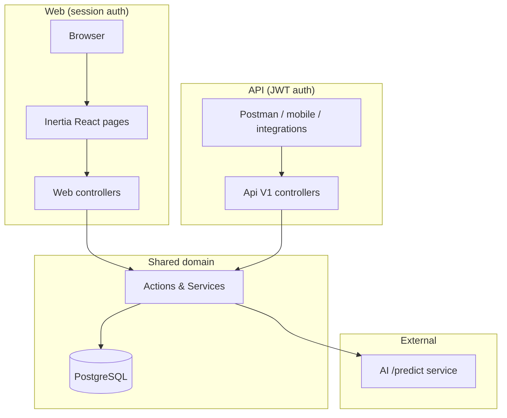

# EthioSME Valuation System

University thesis proof-of-concept for **AI-driven SME lending** in Ethiopia. The platform scores small businesses using **forecasted cash flows**, **psychometric willingness-to-repay**, and **macroeconomic factors**—not physical collateral—and turns that into an **NPV-based credit limit** with **SHAP explainability** for loan officers and regulators.

**Monorepo layout:** Laravel 13 backend + React 18 (Inertia.js) frontend in `resources/js/`. The Python/XGBoost inference service runs separately (Hugging Face Space or local FastAPI); this repo orchestrates calls to it and owns all persistence, auth, and business rules.

---

## Table of Contents

1. [What the system does](#what-the-system-does)
2. [Tech stack](#tech-stack)
3. [Architecture](#architecture)
4. [User roles & portals](#user-roles--portals)
5. [Loan application lifecycle](#loan-application-lifecycle)
6. [AI valuation pipeline](#ai-valuation-pipeline)
7. [Backend (implemented)](#backend-implemented)
8. [Frontend (implemented)](#frontend-implemented)
9. [Database overview](#database-overview)
10. [API reference (v1)](#api-reference-v1)
11. [Web routes (Inertia)](#web-routes-inertia)
12. [Getting started](#getting-started)
13. [Development commands](#development-commands)
14. [Testing](#testing)
15. [Docker](#docker)
16. [Related documentation](#related-documentation)

---

## What the system does

| Stakeholder | Core question | How the system answers |
|-------------|---------------|------------------------|
| **SME owner** | How much can I borrow? | Daily payment heartbeat → AI 30-day cashflow forecast → NPV → credit limit + APR |
| **Loan provider** | Is this application safe and explainable? | Risk band, PD, SHAP drivers, forecast bands; trigger AI run; approve/reject with reason codes |
| **Super admin** | Is the model fair and current? | Macro factors, fairness audits, drift metrics, model training jobs, audit logs |

The PoC simulates **Chapa** payment ingestion, aggregates **daily heartbeat** features, runs **psychometric** assessments (v1/v2), and persists every material decision for **PDPP/NBE-style** auditability.

---

## Tech stack

| Layer | Technology |
|-------|------------|
| Backend | PHP 8.3, Laravel 13 |
| Frontend | React 18, TypeScript, Inertia.js 2, Tailwind CSS 3 |
| Auth (API) | JWT (`tymon/jwt-auth`) |
| Auth (Web) | Laravel Breeze session |
| RBAC | Spatie Laravel Permission (dual guard: `api` + `web`) |
| DTOs | Spatie Laravel Data |
| Auditing | `owen-it/laravel-auditing` on key models |
| Charts | ECharts + `echarts-for-react` |
| Database | PostgreSQL (Supabase in production; SQLite in-memory for tests) |
| AI service | External HTTP service (`POST /predict`, contract **v1**) |
| Build | Vite 6, Composer, npm |

---

## Architecture

### Domain-Driven Design

All business logic lives under `app/Domain/{Name}/`:

```
Domain/{Name}/
├── Actions/      # Single-purpose commands (execute())
├── Services/     # Stateful orchestration
├── Data/         # Spatie DTOs
├── Enums/        # Domain constants
├── Policies/     # Authorization
├── Requests/     # Form request validation
└── Exceptions/   # Domain errors
```

Controllers in `app/Http/Controllers/` stay thin: **authorize → delegate to Action/Service → respond**.

### Two entry points, one domain layer



**Important:** Inertia pages receive data from Laravel via `Inertia::render()` props. They do **not** call `/api/v1` directly unless you add a separate client layer. Web forms use Inertia `router.post()` / `useForm`.

### Ten domain modules

| Domain | Responsibility |
|--------|----------------|
| `Auth` | JWT issue/refresh/revoke, registration, web role aliases |
| `Business` | SME profile CRUD |
| `Lending` | Loan applications, status machine, approve/reject decisions |
| `Valuation` | AI `/predict` orchestration, NPV, SHAP persistence |
| `Psychometric` | Question bank, scoring (v1 + v2 dimensions) |
| `Payments` | Chapa webhook + synthetic statement simulation |
| `TimeSeries` | Raw transactions → daily heartbeat aggregation |
| `Macroeconomics` | Exogenous factors (policy rate, inflation, FX) |
| `Governance` | Fairness audits, drift metrics, AI training jobs |
| `Compliance` | Consents, erasure requests, audit logs |
| `Dashboard` | Role-aware KPIs for Inertia dashboard |

---

## User roles & portals

Canonical Spatie roles (seeded on both `api` and `web` guards):

| Role | API name | Web middleware alias | Portal |
|------|----------|----------------------|--------|
| SME owner | `sme_owner` | `sme-owner` | Loan application, psychometrics, valuation |
| Loan provider | `loan_provider` | `loan_provider` / `loan-provider` | Risk & forecast, pipeline (placeholder), decisioning (placeholder) |
| Super admin | `super_admin` | `super-admin` | Users, macro factors, fairness, model training |

Legacy alias `loan_officer` is mapped to `loan_provider` permissions.

### Demo users (`php artisan db:seed`)

| Email | Role | Password |
|-------|------|----------|
| `admin@ethiosme.test` | super_admin | `password` |
| `officer@ethiosme.test` | loan_provider | `password` |
| `ato-girma-merkato-retail@test.et` | sme_owner (creditworthy) | `password` |
| `w-ro-tigist-bole-coffee@test.et` | sme_owner (borderline) | `password` |
| `ato-bereket-piassa-crafts@test.et` | sme_owner (high risk) | `password` |

`DevDemoSeeder` creates three SME scenarios with psychometric scores, heartbeat data, and loan applications ready for AI valuation.

---

## Loan application lifecycle

```
draft → submitted → pending_psychometric → pending_data_sync
     → queued_for_ai → processing → evaluated → {approved | rejected | withdrawn}
```

- Status constants: `App\Models\LoanApplication`
- Transitions guarded in lending services/actions
- AI run allowed when `isReadyForValuation()` (`queued_for_ai` or `pending_data_sync`)
- After successful AI run, application moves to **`evaluated`** with snapshot fields (`ai_risk_band`, `prob_default`, `snapshot_risk_score`, etc.)

---

## AI valuation pipeline

### Configuration (`.env`)

```env
AI_SERVICE_URL=https://leykun-code-ethiopian-sme-ai-service.hf.space
AI_SERVICE_TOKEN=              # Hugging Face X-Internal-Key
AI_SERVICE_CONTRACT_VERSION=v1
AI_SERVICE_PREDICT_PATH=/predict
AI_SERVICE_AUTHENTICATED=false # set true + token for HF Space
VALUATION_CASHFLOW_HAIRCUT=0.30
```

NPV tuning: `config/valuation.php` (discount rates, psychometric relief, limit multiples).

### Flow

1. **`InferenceOrchestratorService`** builds a selector payload (`business_uuid`, lookback/horizon, psychometric/macro refs).
2. **`AiEngineClient::predict()`** → `POST {AI_SERVICE_URL}/predict` (not under `/api/v1` prefix).
3. **`InferenceResponseData`** normalises v1 response (`p10_cashflow_forecast`, `ai_risk_score`, SHAP, reason codes).
4. **`CalculateNpvAction`** computes NPV credit limit from P10 cashflows + policy rate.
5. **`PersistShapExplanationsAction`** stores explainability rows.
6. **`RunValuationAction`** wraps the transaction, links `loan_applications.valuation_id`, updates status.

Entry points:

- **API:** `POST /api/v1/businesses/{business}/valuate`
- **Web (SME):** `POST /sme-valuation/{business}/run`
- **Web (lender):** `POST /loan-applications/{loanApplication}/run-ai`

---

## Backend (implemented)

### Authentication & authorization

| Feature | Status |
|---------|--------|
| JWT register / login / refresh / logout | ✅ |
| Session auth (Breeze) for Inertia | ✅ |
| Spatie permissions (PRD matrix) | ✅ |
| Policies on Business, LoanApplication, Valuation, etc. | ✅ |
| Refresh token families | ✅ |
| Idempotency on loan application create | ✅ |

### Business & lending

| Feature | Status |
|---------|--------|
| Business CRUD (API) | ✅ |
| Create loan application (API + web) | ✅ |
| Loan decision approve/reject + adverse action (API) | ✅ |
| Loan provider scoping (`loan_provider_id`) | ✅ |
| Application pipeline list (API) | ✅ |

### Psychometric

| Feature | Status |
|---------|--------|
| Question bank v1 + v2 | ✅ |
| Score assessment action | ✅ |
| API submit + questions endpoint | ✅ |
| Web results page + public token test route | ✅ |

### Payments & time series

| Feature | Status |
|---------|--------|
| Chapa webhook ingestion | ✅ |
| Chapa simulate (synthetic 60-day statements) | ✅ API only |
| Daily heartbeat aggregation | ✅ |
| Scheduled `heartbeat:aggregate` (01:00 daily) | ✅ |
| CSV heartbeat seeder | ✅ |

### Valuation

| Feature | Status |
|---------|--------|
| AI health check endpoint | ✅ |
| Run valuation + latest valuation read | ✅ |
| NPV calculation from P10 forecast | ✅ |
| SHAP persistence | ✅ |
| AI evaluation audit logs | ✅ |
| Fallback when AI unavailable (config flag) | ✅ |

### Macroeconomics & governance

| Feature | Status |
|---------|--------|
| Exogenous factors upsert/list (API) | ✅ |
| Fairness audit run + list | ✅ |
| Drift metrics read | ✅ |
| AI training job proxy to FastAPI `/api/v1/training/jobs` | ✅ |

### Compliance

| Feature | Status |
|---------|--------|
| GDPR-style consent recording | ✅ |
| Erasure request creation | ✅ |
| Audit log read (super admin) | ✅ |
| Owen-it model auditing (LoanApplication, Business, LoanProvider) | ✅ |

### Web-only controllers

| Controller | Purpose |
|------------|---------|
| `DashboardController` | Role-aware stats via `DashboardStatsService` |
| `LoanApplicationWebController` | SME loan application + heartbeat preview |
| `PsychometricWebController` | Assessment results + public test flow |
| `SmeValuationController` | Run/view valuation for owner |
| `RiskAndForecastController` | Lender pipeline table with AI snapshots |
| `LoanApplicationRunAiController` | Trigger AI from lender UI |
| `ModelTrainingController` | Queue/sync training jobs |
| `UserManagementController` | Super admin user CRUD |

### Gaps / technical debt (backend)

- Chapa simulate has **no web UI** (API-only)
- `RecordDriftMetricsAction` / security incident logging — limited HTTP exposure
- Post-valuation UX depends on lender visiting Risk & Forecast
- Some governance tables may be empty until seeded or triggered manually

---

## Frontend (implemented)

**Stack:** React 18 + Inertia + Tailwind + Headless UI + Lucide icons + ECharts (installed; charts used incrementally).

**State:** Inertia page props only (no global Redux). Theme toggle + sidebar preferences in `localStorage`.

### Pages by role

#### Public

| Page | Route | Status |
|------|-------|--------|
| `Landing` | `/` | ✅ Marketing landing |
| `Auth/*` | `/login`, `/register`, etc. | ✅ Breeze |
| `Borrower/PsychometricTest` | `/psychometric-test` | ✅ Token-based public assessment |

#### SME owner (`sme-owner`)

| Page | Route | Status |
|------|-------|--------|
| `Dashboard` | `/dashboard` | ✅ Role KPIs, application journey, latest valuation card |
| `Borrower/LoanApplication` | `/loan-application` | ✅ Heartbeat table, submit application, ensure business |
| `Borrower/PsychometricResults` | `/psychometrics` | ✅ v1/v2 dimension scores |
| `Borrower/SmeValuation` | `/sme-valuation` | ✅ Summary, SHAP bars, forecast table, run valuation |
| `Placeholders/Integrations` | `/integrations` | ⬜ Placeholder (“Connect Chapa”) |

#### Loan provider (`loan_provider`)

| Page | Route | Status |
|------|-------|--------|
| `Dashboard` | `/dashboard` | ✅ Pipeline stats, AI health, pending counts |
| `Lender/RiskAndForecast` | `/risk-forecast` | 🟡 Application table, risk badges, expandable SHAP; run AI button |
| `Placeholders/ApplicationsPipeline` | `/applications-pipeline` | ⬜ Placeholder |
| `Placeholders/DecisioningAndXAI` | `/decisioning-xai` | ⬜ Placeholder (approve/reject UI not built) |

#### Super admin (`super-admin`)

| Page | Route | Status |
|------|-------|--------|
| `Dashboard` | `/dashboard` | ✅ System KPIs, training job summary |
| `Admin/Users` | `/admin/users` | ✅ Full user CRUD with role assignment |
| `Admin/ModelTraining` | `/admin/model-training` | ✅ Queue jobs, sync status, health display |
| `Placeholders/MacroeconomicFactors` | `/admin/macroeconomic-factors` | ⬜ Placeholder |
| `Placeholders/FairnessAudit` | `/admin/fairness-audit` | ⬜ Placeholder |

#### Shared

| Page | Route | Status |
|------|-------|--------|
| `Profile/Edit` | `/profile` | ✅ Breeze profile |
| `AuthenticatedLayout` | — | ✅ Sidebar nav by role, dark mode, resizable sidebar |

### Feature components (`resources/js/features/valuation/`)

| Component | Purpose |
|-----------|---------|
| `ValuationSummary` | NPV limit, risk class, APR |
| `ForecastBands` | P10/P50/P90 display (table-based) |
| `ShapDrivers` | Horizontal SHAP contribution bars |

### Frontend gaps (vs full PRD vision)

- No full **ECharts** P10 “red cone” probabilistic chart on Risk & Forecast
- No **SHAP waterfall** chart summing to model score
- No **approve/reject** modal with mandatory reason codes in UI
- **Integrations**, **Applications Pipeline**, **Decisioning & XAI**, **Macro**, **Fairness** pages are placeholders
- No dedicated JWT API client in the browser (by design for Inertia)

---

## Database overview

**33 migrations** — PostgreSQL-oriented schema.

| Table | Purpose |
|-------|---------|
| `users` | Identity |
| `businesses` | SME static profile (`uuid`, sector, sub_city) |
| `loan_providers` | Lender organisations |
| `psychometric_assessments` | Willingness scores (v1 + v2 dimensions) |
| `raw_transactions` | Append-only payment ledger |
| `sme_daily_heartbeat` | LSTM/feature input series |
| `exogenous_factors` | Macro covariates |
| `loan_applications` | Origination + AI snapshot fields |
| `valuations` | Per-inference run (forecasts, NPV, risk) |
| `shap_explanations` | Normalised SHAP rows |
| `adverse_action_notices` | Rejection audit trail |
| `ai_evaluation_logs` | Inference request/response audit |
| `ai_training_jobs` | Model retrain tracking |
| `fairness_audits`, `drift_metrics` | Governance |
| `consents`, `data_subject_requests`, `audit_logs`, `security_incidents` | Compliance |
| `refresh_token_families` | JWT refresh rotation |
| Spatie `roles` / `permissions` + `audits` | RBAC + change log |

See `docs/supabase-schema.md` and `database/migrations/README.md` for detail.

---

## API reference (v1)

Base URL: `/api/v1` — JWT via `Authorization: Bearer {token}` unless noted.

| Method | Endpoint | Description |
|--------|----------|-------------|
| GET | `/ai/health` | AI service health (public) |
| POST | `/auth/register`, `/login`, `/refresh` | Auth |
| POST | `/auth/logout` | Logout (permission) |
| GET | `/auth/me` | Current user |
| GET/POST/PATCH | `/businesses` | Business CRUD |
| GET | `/psychometric/questions` | Question bank |
| POST | `/businesses/{id}/psychometric-assessments` | Submit assessment |
| POST | `/businesses/{id}/valuate` | Run AI valuation |
| GET | `/businesses/{id}/valuation/latest` | Latest valuation |
| POST | `/payments/chapa/webhook`, `/simulate` | Payment ingest |
| GET/POST | `/applications` | Loan applications |
| POST | `/applications/{id}/decision` | Approve/reject |
| GET/POST | `/loan-providers` | Lender orgs |
| POST | `/me/consents` | Record consent |
| POST | `/me/privacy/erasure-requests` | Erasure request |
| GET | `/admin/fairness-audits`, `/admin/drift-metrics` | Governance read |
| GET/POST | `/admin/exogenous-factors` | Macro (super_admin) |
| POST | `/admin/fairness-audits` | Run fairness audit |
| GET | `/admin/audit-logs` | Compliance audit trail |
| GET/POST | `/admin/training/jobs` | AI training jobs |

Full PRD contract: `docs/PRD_V1.md`.

---

## Web routes (Inertia)

| Method | Route | Page / action |
|--------|-------|----------------|
| GET | `/` | Landing |
| GET | `/dashboard` | Role-aware Dashboard |
| GET | `/psychometric-test` | Public psychometric test |
| POST | `/psychometric-test/submit` | Submit via token |
| GET | `/loan-application` | SME loan application |
| POST | `/loan-application/submit` | Submit application |
| GET | `/psychometrics` | Psychometric results |
| GET | `/sme-valuation` | SME valuation view |
| POST | `/sme-valuation/{business}/run` | Run valuation |
| GET | `/risk-forecast` | Lender risk table |
| POST | `/loan-applications/{id}/run-ai` | Lender trigger AI |
| GET/POST/PATCH/DELETE | `/admin/users` | User management |
| GET/POST | `/admin/model-training` | Training jobs |

Placeholder routes (Inertia shell only): `/integrations`, `/applications-pipeline`, `/decisioning-xai`, `/admin/macroeconomic-factors`, `/admin/fairness-audit`.

---

## Getting started

### Prerequisites

- PHP 8.3+, Composer 2
- Node.js 18+, npm
- PostgreSQL 16+ (or Docker Compose stack below)
- AI service token if using the hosted Hugging Face Space

### Setup

```bash
# Clone and install
composer install
cp .env.example .env
php artisan key:generate
php artisan jwt:secret

# Configure .env: DB_*, AI_SERVICE_URL, AI_SERVICE_TOKEN

# Database
php artisan migrate
php artisan db:seed   # Roles + loan providers + demo SMEs

# Frontend
npm install
npm run build         # or npm run dev during development
```

### Environment variables (essential)

| Variable | Purpose |
|----------|---------|
| `DB_*` | PostgreSQL connection |
| `JWT_SECRET` | API token signing (`php artisan jwt:secret`) |
| `AI_SERVICE_URL` | Base URL of predict service |
| `AI_SERVICE_TOKEN` | `X-Internal-Key` for HF Space |
| `AI_SERVICE_CONTRACT_VERSION` | `v1` (current) |
| `AI_SERVICE_PREDICT_PATH` | `/predict` |
| `VALUATION_CASHFLOW_HAIRCUT` | NPV conservative haircut (default `0.30`) |

See `.env.example` for the full list.

---

## Development commands

```bash
# Laravel + queue + logs + Vite (recommended)
composer run dev

# All tests (clears config cache first)
composer run test

# Single test file
php artisan test tests/Feature/Valuation/RunValuationPredictTest.php

# Single test method
php artisan test --filter=testMethodName

# PHP style
vendor/bin/pint

# Production frontend build
npm run build

# Nightly heartbeat aggregation (also scheduled 01:00)
php artisan heartbeat:aggregate
```

Agent-oriented quick reference: `CLAUDE.md`.

---

## Testing

PHPUnit uses **SQLite in-memory** (`phpunit.xml`).

| Suite | Examples |
|-------|----------|
| Feature | Auth, profile, `RunValuationPredictTest` |
| Unit | `AiEngineClientPredictTest`, `InferenceOrchestratorPredictTest`, `InferenceResponseDataTest`, heartbeat import |

Tests that call the real AI service require `AI_SERVICE_URL` to be reachable; most valuation tests mock HTTP.

---

## Docker

```bash
docker compose up -d
```

Runs:

- **app** — Laravel on port `8000`
- **postgres** — PostgreSQL 16 on host port `5433`

Set `DB_HOST=postgres` inside the app container. The AI service is **not** included in Compose; point `AI_SERVICE_URL` at HF Space or a local Python instance.

---

## Related documentation

| Document | Contents |
|----------|----------|
| [`CLAUDE.md`](CLAUDE.md) | Commands, architecture summary for AI agents |
| [`docs/PRD_V1.md`](docs/PRD_V1.md) | Backend product requirements |
| [`docs/Context.md`](docs/Context.md) | Master build context & task breakdown |
| [`docs/architechture.md`](docs/architechture.md) | DDD layering rules |
| [`docs/Design.md`](docs/Design.md) | UI/UX notes |
| [`docs/supabase-schema.md`](docs/supabase-schema.md) | Production DB notes |
| [`CODEBASE_STATUS_REPORT.md`](CODEBASE_STATUS_REPORT.md) | Dated completion audit (may lag behind README) |

---

## License

MIT (Laravel framework components). Thesis application code — see your institution’s requirements for academic use.
